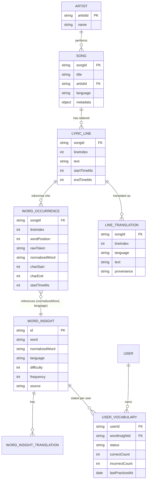
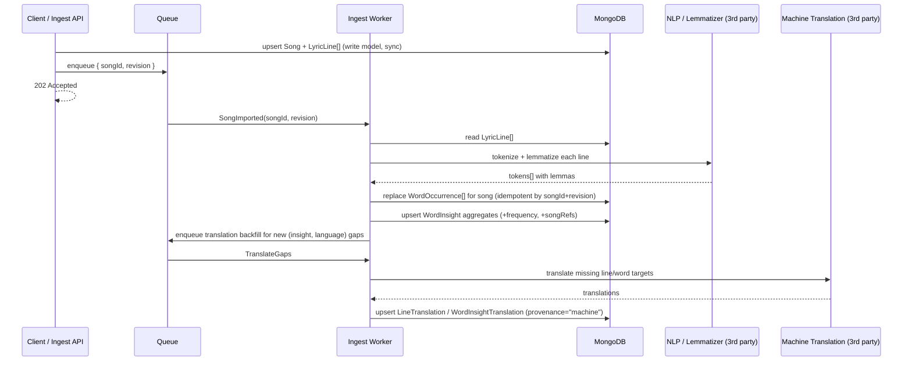
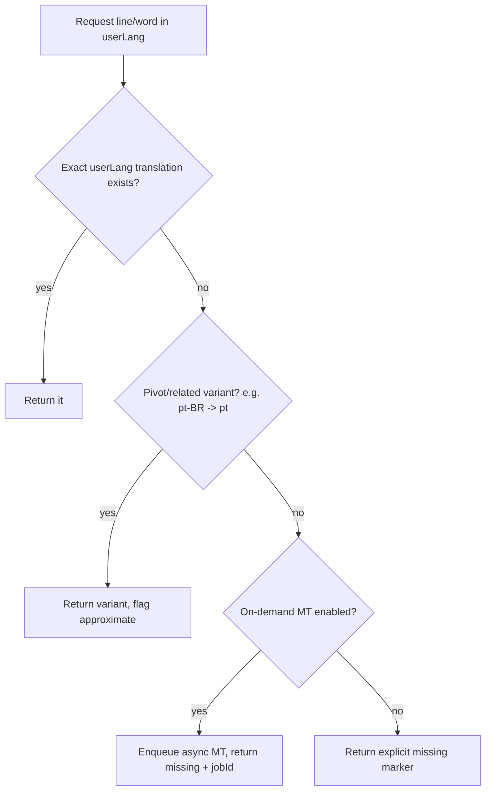

# Part 1 — Architecture Principles

> Backend architecture for an **English-learning-through-music** product: songs with synchronized
> lyrics, line/word translations, word-level learning insights, and per-user vocabulary state.
>
> This document is **written-only** (no implementation). It is intentionally consistent with the
> Part 2 implementation: the `WordInsight` and `UserVocabulary` entities described here are the same
> ones realized in code in Part 2.

---

## 1. Design goals & guiding principles

The brief asks for a design that cleanly separates five concerns. I treat that separation as the
backbone of the architecture, because each concern has a **different access pattern, write
frequency, and ownership**:

| Concern | What it optimizes for | Write frequency | Owner |
|---|---|---|---|
| Original lyric structure (display) | Faithful, ordered rendering with timings | Write-once on import | Catalog |
| Searchable word representation | Fast word/occurrence lookup | Rebuilt on lyric change | Catalog (derived) |
| Translation model (line + word) | Resolving text in the user's language | Async, incremental | Catalog (derived) |
| User vocabulary state | Per-user knowledge tracking | High, per interaction | User |
| Insight generation | Aggregating words into learnable units | Async, batch | Pipeline |

**Core principle: separate the *write model* (faithful source-of-truth lyrics) from *read models*
(denormalized, indexed projections).** Lyrics are imported once and read millions of times; we pay
the cost at write time to make reads cheap and simple.

Two more principles drive every decision below:

- **Global catalog vs. per-user state are different collections with different lifecycles.** A song's
  insights are shared by every user; only the `UserVocabulary` rows are user-owned. This keeps the
  catalog cacheable/immutable and lets user writes scale independently.
- **Derivable data is derived asynchronously and idempotently.** Word occurrences, insights, and
  machine translations are all *projections* of the source lyrics. They can be rebuilt at any time, so
  ingestion is a pipeline of idempotent steps rather than one big synchronous transaction.

---

## 2. Data model — entities & relationships



### 2.1 Original lyric structure — *display* (`Song`, `Artist`, `LyricLine`)

The **source of truth**, stored exactly as received and never lossy. `LyricLine` preserves order
(`lineIndex`), original `text`, and optional `startTimeMs`/`endTimeMs` for karaoke-style sync. This
model alone answers *"display the lyrics in order"* with a single indexed range query.

```jsonc
// LyricLine (write model — faithful to source)
{
  "songId": "song_001",
  "lineIndex": 0,
  "startTimeMs": 1200,
  "endTimeMs": 4200,
  "text": "I found a love for me"
}
```

**What I keep / change / enrich vs. the example DTO:**
- **Keep:** `songId`, `title`, `artist`, `language`, the ordered `lyrics[]` with `lineIndex` + timings.
- **Change:** the inline `translation` on each line is *moved out* into its own `LineTranslation`
  collection (see §4). A line can have 0..N translations; embedding only one language doesn't scale.
- **Enrich:** add `metadata` (album, release year, ISRC) and a `revision` counter on the song so
  derived projections know when to rebuild.

### 2.2 Searchable word representation — *queries* (`WordOccurrence`)

A line of text is bad for querying ("find every place *love* appears"). So at import we **tokenize
each line into one `WordOccurrence` document per word position**. This is the index that powers word
search, occurrence queries, and frequency counts.

```jsonc
// WordOccurrence (derived read model — one per word position)
{
  "songId": "song_001",
  "lineIndex": 0,
  "wordPosition": 3,            // 0-based position within the line
  "rawToken": "love",          // exactly as it appears
  "normalizedWord": "love",    // lemma — links to WordInsight
  "charStart": 11,              // offset into LyricLine.text (for tap-to-highlight)
  "charEnd": 15,
  "startTimeMs": 1200           // inherited/interpolated from the line
}
```

The pair `(normalizedWord, language)` is the **join key** to `WordInsight`. We deliberately do *not*
store translations or difficulty here — those live on the shared insight, so a single edit to an
insight is reflected across every occurrence.

### 2.3 Global word insights — *learning units* (`WordInsight`)

Aggregated **once per `(normalizedWord, language)`** across the whole catalog. This is the entity
Part 2 builds on. It carries everything needed to *learn/practice* a word: translations, difficulty,
frequency, example sentences, and lightweight back-references to songs/images.

```jsonc
{
  "id": "insight_001",
  "word": "darling",
  "normalizedWord": "darling",
  "language": "en",
  "translations": [ { "language": "es", "text": "cariño" }, { "language": "pt", "text": "querido" } ],
  "difficulty": 2,             // 1..5 intrinsic difficulty
  "frequency": 12,             // occurrences across the catalog
  "source": "song",
  "songRefs": [ { "songId": "song_001", "title": "Example Song", "occurrences": 1 } ],
  "imageRefs": [ { "id": "image_darling_001", "url": "https://.../darling.png", "alt": "..." } ],
  "examples": [ { "text": "Darling, just dive right in", "translations": [ { "language": "es", "text": "Cariño, simplemente lánzate" } ] } ]
}
```

`songRefs` are intentionally **lightweight** (id + title + count) so the practice layer never needs
full lyrics. This is exactly what lets Part 2 stand alone.

### 2.4 User vocabulary state — *per-user* (`UserVocabulary`)

Stored **separately** from the catalog, one row per `(userId, wordInsightId)`. It answers *"does this
user already know this word?"* and accumulates practice stats.

```jsonc
{
  "userId": "user_001",
  "wordInsightId": "insight_002",
  "normalizedWord": "love",
  "language": "en",
  "status": "known",          // unknown | learning | known | ignored
  "correctCount": 3,
  "incorrectCount": 1,
  "lastPracticedAt": "2026-06-13T10:00:00Z"
}
```

Keeping this in its own collection means: the catalog stays immutable & cacheable; user writes (the
hot path) don't contend with catalog reads; and a user's data can be exported/deleted independently
(GDPR-friendly).

---

## 3. Lyrics ingestion — import → tokenize → normalize → index



**Steps:**

1. **Import (sync, fast):** validate and store `Song` + `LyricLine[]` as-is, bump `revision`. Return
   `202 Accepted` immediately — the user-facing catalog write is tiny and transactional.
2. **Tokenize (async):** split each line into tokens, preserving `wordPosition` and `charStart/charEnd`
   for tap-to-highlight. Punctuation/casing handled by a shared normalizer.
3. **Normalize / lemmatize (async):** map surface forms to a lemma (e.g. `"done" → "do"`,
   `"loving" → "love"`) via a 3rd-party NLP service. This is the `normalizedWord`, the unit users
   actually learn. (Lemmatization is language-specific → see §8 scaling.)
4. **Index (async):** **replace** the song's `WordOccurrence[]` (delete-by-`songId` + insert) so
   re-imports are idempotent. Recompute `WordInsight` aggregates: increment `frequency`, merge
   `songRefs`.
5. **Translation backfill (async):** detect `(insight, language)` gaps and enqueue machine translation.

**Update strategy:** edits to lyrics bump `revision` and re-run steps 2–5 for that song only. Because
every derived write is keyed by `songId`/`(normalizedWord, language)` and is a `replace`/`upsert`, the
pipeline is safe to retry and re-run — no duplicates, no drift.

**Query strategy:** word search and occurrence lookups hit `WordOccurrence` indexes directly (see §7),
never the raw lyric text.

---

## 4. Translations — representation & resolution

Translations exist at **two levels**, both stored *out-of-line* from the source so a line/word can
have any number of target languages:

- **Line-level** (`LineTranslation`): `(songId, lineIndex, language) → text`. Powers "show me the whole
  line in Spanish."
- **Word-level** (`WordInsightTranslation`, embedded in `WordInsight.translations[]`):
  `(normalizedWord, language) → text`. Powers tap-a-word and all Part 2 exercises.

Each translation carries **`provenance`** (`human` | `machine` | `community`) and `confidence`, so the
UI can label machine output and humans can override it later.

### Resolution & fallback (when the user's language is missing)



**Missing translations are represented explicitly**, never as `null` text masquerading as a real
translation:

```jsonc
{ "language": "fr", "status": "missing", "text": null, "fallbackUsed": null }
// vs. a resolved one:
{ "language": "es", "status": "available", "text": "cariño", "provenance": "human" }
```

This lets clients render a clear "translation not available yet" state and optionally trigger
on-demand generation, instead of silently showing blanks.

---

## 5. Core operations — synchronous vs. asynchronous

| Operation | Mode | Rationale |
|---|---|---|
| Display lyrics in order | **Sync** | Single indexed range read on `LyricLine`. |
| Word occurrence query | **Sync** | Indexed read on `WordOccurrence`. |
| Line/word translation lookup | **Sync** | Indexed read; may *trigger* async MT on miss. |
| Song insights for a user | **Sync** | Read insights + user vocab, compute difficulty on the fly (cacheable). |
| Update user vocabulary state | **Sync** | Single-row upsert; the hot user write path. |
| Lyrics import | **Sync write, async derive** | Store source fast (202), build projections in background. |
| Tokenize / normalize / index | **Async** | CPU-heavy, 3rd-party calls, retryable. |
| Insight aggregation | **Async** | Batch, idempotent, eventually consistent. |
| Translation generation | **Async** | External MT latency; backfilled. |

**Rule of thumb:** anything a user blocks on (reads, single-row writes) is synchronous; anything
derivable, batchy, or dependent on a 3rd party is asynchronous and idempotent.

### Word occurrence query — example

```jsonc
// GET occurrences of "love" in song_001  -> answers the brief's required fields
[
  {
    "normalizedWord": "love",
    "songId": "song_001",
    "lineIndex": 0,
    "wordPosition": 3,
    "originalLineText": "I found a love for me",
    "rawToken": "love",
    "startTimeMs": 1200,
    "endTimeMs": 4200
  }
]
```

### Song insights / difficulty — example

```jsonc
// GET insights for (song_001, user_001)
{
  "songId": "song_001",
  "userId": "user_001",
  "totalWords": 7,
  "uniqueWords": 6,
  "repeatedWords": [ { "normalizedWord": "love", "count": 2 } ],
  "byStatus": { "known": 3, "learning": 1, "unknown": 2, "ignored": 0 },
  "difficultyScore": 0.33
}
```

**Difficulty model.** Baseline (acceptable per the brief):

```
difficultyScore = unknownUniqueWords / totalUniqueWords
```

Richer, still explainable & testable — weight each unknown/learning word by intrinsic difficulty and
inverse frequency (rarer words are harder), normalized to `[0,1]`:

```
weight(w)   = difficulty(w) * (learningCounts ? 0.5 : 1)      // learning words count half
score       = Σ weight(w) for unknown/learning unique words
              ───────────────────────────────────────────
              Σ difficulty(w) for all unique words
```

Both are pure functions of (insights, user vocab) → trivial to unit test, and the model is a single
swappable function.

---

## 6. Optimization strategies & patterns

- **CQRS-style read models.** `WordOccurrence` and `WordInsight` are denormalized projections built for
  the exact queries the app makes. Reads never touch raw lyrics.
- **Idempotent upserts keyed by natural keys** (`songId`, `(normalizedWord, language)`,
  `(userId, wordInsightId)`) → safe retries, no duplicates, easy re-derivation.
- **Compute-on-read + cache** for per-user difficulty/insights (a pure function), invalidated on user
  vocab change. Avoids storing a value that goes stale on every catalog edit.
- **Pagination & projections everywhere** (cursor-based on stable sort keys) to bound payloads.
- **Pre-aggregated `frequency` / `songRefs`** on insights so "high-frequency words" is a sorted read,
  not a catalog-wide scan.
- **Outbox / queue for async steps** so ingestion survives worker restarts and 3rd-party outages.

---

## 7. Indexing strategy

| Collection | Index | Serves |
|---|---|---|
| `lyric_lines` | `(songId, lineIndex)` unique | ordered display, line lookup |
| `word_occurrences` | `(songId, normalizedWord)` | word occurrences in a song |
| `word_occurrences` | `(normalizedWord)` | cross-song search, frequency |
| `word_occurrences` | `(songId, lineIndex, wordPosition)` unique | tap-a-word resolution |
| `word_insights` | `(normalizedWord, language)` unique | join key, upsert key |
| `word_insights` | `(language, source, difficulty)` | catalog filtering |
| `line_translations` | `(songId, lineIndex, language)` unique | line translation resolution |
| `user_vocabulary` | `(userId, wordInsightId)` unique | user state lookup/upsert |
| `user_vocabulary` | `(userId, status)` | summary counts |

---

## 8. Error handling & invalid input (high level)

- **Validate at the boundary.** Reject malformed import DTOs with a structured 422 (which field, which
  line). Source data is never partially persisted in a broken state.
- **Partial-success reporting for batch imports.** Return a summary
  `{ created, updated, skipped, rejected[] }` rather than failing the whole batch — one bad line
  shouldn't drop a whole song/dataset. (This is exactly the Part 2 import contract.)
- **Async failures → retries + dead-letter queue.** Tokenization/translation failures are retried with
  backoff; permanent failures land in a DLQ with the offending payload for inspection, while the rest of
  the song proceeds.
- **Explicit "missing" over silent null.** Missing translations/insights are first-class states (§4),
  not error conditions — the app degrades gracefully.
- **Idempotency keys** on ingest so client retries don't double-import.

---

## 9. Scaling — more songs, users, languages

- **More songs (catalog growth):** the catalog is read-heavy and immutable → scale with read replicas
  and a CDN/cache in front of insights. `word_occurrences` is the largest collection; shard by `songId`
  (co-locates a song's words, keeps occurrence queries single-shard).
- **More users (write growth):** `user_vocabulary` and `exercise_attempts` are the write-hot
  collections → shard by `userId` so a user's reads/writes stay on one shard and user load spreads
  evenly. This is decoupled from the catalog entirely.
- **More languages:** translations are additive `(entity, language)` rows, so a new language is a
  backfill job, not a schema change. Lemmatization/NLP is language-specific → the ingest pipeline
  selects a per-language analyzer; partition translation-generation workers by language so one slow
  language can't starve others.
- **Insight generation throughput:** the pipeline is horizontally scalable (stateless workers off a
  queue, idempotent steps), so import throughput scales by adding workers.

---

## 10. Third-party service assumptions

| Service | Used for | Assumption |
|---|---|---|
| NLP / lemmatizer (e.g. spaCy/Stanza service) | tokenization + normalization (`normalizedWord`) | per-language model available; called async, batchable. |
| Machine translation (e.g. DeepL/Google) | filling missing line/word translations | async, rate-limited; output flagged `provenance="machine"`. |
| Object storage + CDN (e.g. S3 + CloudFront) | `imageRefs` for image exercises, cached lyrics/insights | URLs are stable & public-readable. |
| Message queue (e.g. SQS/RabbitMQ/Kafka) | ingest & translation pipeline | at-least-once delivery → all consumers idempotent. |
| (Optional) Cache (e.g. Redis) | per-user difficulty, hot insights | invalidated on user-vocab / catalog change. |

---

## 11. How Part 1 connects to Part 2

Part 2 implements the **practice layer** on top of the two entities defined here that don't require
lyric processing:

- **`WordInsight`** — imported/seeded directly (§2.3), with lightweight `songRefs` so no lyrics are
  needed.
- **`UserVocabulary`** — the per-user state (§2.4), updated directly or via exercise attempts.

Everything upstream (lyrics, occurrences, line translations, the ingestion pipeline) is the
"insight-generation process" that Part 2 assumes has already run.
