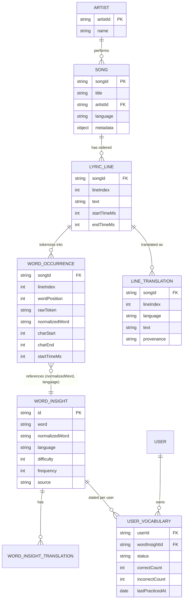
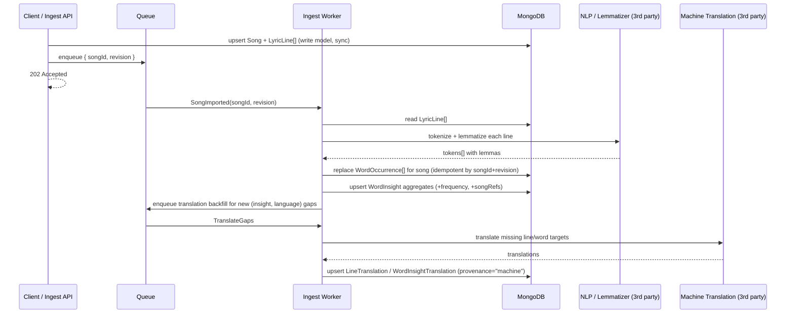
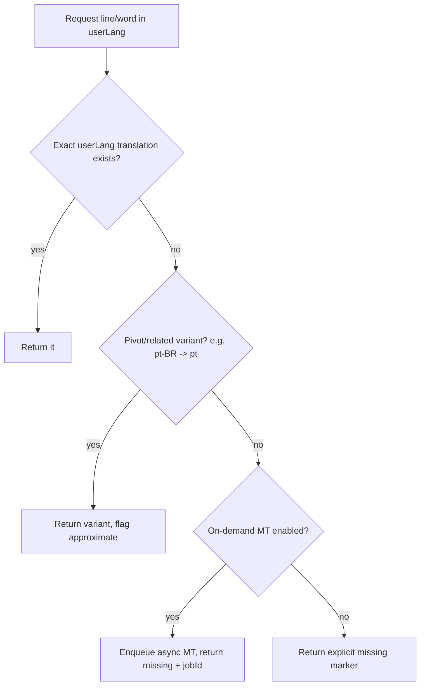

# Part 1 — Architecture Principles

## 1. Design goals & guiding principles

The brief asks for a design that clearly separates five concerns. I used that separation as the
backbone of the whole thing, because each one behaves differently: they are written at different
times, owned by different parts of the system, and read in different ways.

| Concern                            | What it optimizes for                    | Write frequency            | Owner             |
| ---------------------------------- | ---------------------------------------- | -------------------------- | ----------------- |
| Original lyric structure (display) | Faithful, ordered rendering with timings | Once, on import            | Catalog           |
| Searchable word representation     | Fast word/occurrence lookup              | Rebuilt when lyrics change | Catalog (derived) |
| Translation model (line + word)    | Showing text in the user's language      | Incremental, async         | Catalog (derived) |
| User vocabulary state              | Tracking what each user knows            | High, every interaction    | User              |
| Insight generation                 | Turning words into learnable units       | Batch, async               | Pipeline          |

The main idea behind the design is to keep the _write model_ (the original lyrics, stored exactly as
imported) separate from the _read models_ (the indexed, pre-shaped data we actually query). A song is
imported once but read constantly, so it pays off to do the heavy work at import time and keep reads
simple.

Two more ideas guide the rest of the document:

- **The shared catalog and the per-user state are different collections with different lifecycles.**
  A song and its insights are the same for everyone; only the `UserVocabulary` rows belong to a
  specific user. Splitting them keeps the catalog easy to cache and lets user writes grow on their own.
- **Anything that can be re-derived is built asynchronously and idempotently.** Word occurrences,
  insights and machine translations are all just projections of the original lyrics. Since they can be
  rebuilt at any time, import is a chain of small, repeatable steps rather than one big transaction.

---

## 2. Data model — entities & relationships



### 2.1 Original lyric structure — _display_ (`Song`, `Artist`, `LyricLine`)

This is the source of truth. We store it exactly as it arrives and never throw anything away.
`LyricLine` keeps the order (`lineIndex`), the original `text`, and optional
`startTimeMs`/`endTimeMs` for karaoke-style highlighting. On its own this model already answers
"display the lyrics in order" with one indexed range query.

```jsonc
// LyricLine (write model — faithful to the source)
{
  "songId": "song_001",
  "lineIndex": 0,
  "startTimeMs": 1200,
  "endTimeMs": 4200,
  "text": "I found a love for me",
}
```

What I keep, change or enrich compared to the example DTO:

- **Keep:** `songId`, `title`, `artist`, `language`, and the ordered `lyrics[]` with `lineIndex` and
  timings.
- **Change:** the inline `translation` on each line moves out into its own `LineTranslation`
  collection (see §4). A line can have any number of translations, so embedding a single language
  doesn't hold up once you add more.
- **Enrich:** add some `metadata` (album, release year, ISRC) and a `revision` counter on the song,
  so the derived data knows when it needs to be rebuilt.

### 2.2 Searchable word representation — _queries_ (`WordOccurrence`)

Plain text is awkward to query: there's no clean way to ask "where does _love_ appear?" against a
string. So when a song is imported we split each line into words and store one `WordOccurrence` per
word position. This is the index behind word search, occurrence lookups and frequency counts.

```jsonc
// WordOccurrence (derived read model — one per word position)
{
  "songId": "song_001",
  "lineIndex": 0,
  "wordPosition": 3, // 0-based position within the line
  "rawToken": "love", // exactly as it appears
  "normalizedWord": "love", // lemma — links to WordInsight
  "charStart": 11, // offset into LyricLine.text (for tap-to-highlight)
  "charEnd": 15,
  "startTimeMs": 1200, // inherited/interpolated from the line
}
```

The pair `(normalizedWord, language)` is the link to `WordInsight`. We intentionally don't store
translations or difficulty here. Those live on the shared insight, so editing one insight is
reflected in every occurrence automatically.

### 2.3 Global word insights — _learning units_ (`WordInsight`)

Built once per `(normalizedWord, language)` across the whole catalog. This is the entity Part 2 is
built on. It carries everything you need to learn or practice a word: translations, difficulty,
frequency, example sentences, and light references back to the songs and images it came from.

```jsonc
{
  "id": "insight_001",
  "word": "darling",
  "normalizedWord": "darling",
  "language": "en",
  "translations": [
    { "language": "es", "text": "cariño" },
    { "language": "pt", "text": "querido" },
  ],
  "difficulty": 2, // 1..5 intrinsic difficulty
  "frequency": 12, // occurrences across the catalog
  "source": "song",
  "songRefs": [
    { "songId": "song_001", "title": "Example Song", "occurrences": 1 },
  ],
  "imageRefs": [
    {
      "id": "image_darling_001",
      "url": "https://.../darling.png",
      "alt": "...",
    },
  ],
  "examples": [
    {
      "text": "Darling, just dive right in",
      "translations": [
        { "language": "es", "text": "Cariño, simplemente lánzate" },
      ],
    },
  ],
}
```

`songRefs` are kept light on purpose (just id, title and a count), so the practice layer never has to
touch full lyrics. That's exactly what lets Part 2 stand on its own.

### 2.4 User vocabulary state — _per-user_ (`UserVocabulary`)

Stored separately from the catalog, one row per `(userId, wordInsightId)`. It answers "does this user
already know this word?" and keeps the practice stats.

```jsonc
{
  "userId": "user_001",
  "wordInsightId": "insight_002",
  "normalizedWord": "love",
  "language": "en",
  "status": "known", // unknown | learning | known | ignored
  "correctCount": 3,
  "incorrectCount": 1,
  "lastPracticedAt": "2026-06-13T10:00:00Z",
}
```

Keeping this in its own collection has three nice effects: the catalog stays immutable and cacheable,
user writes (the busy path) don't compete with catalog reads, and a single user's data can be
exported or deleted on its own.

---

## 3. Lyrics ingestion — import → tokenize → normalize → index

Songs are imported whole, not fragment by fragment. The request carries the song plus its full list
of lyric lines; we store that immediately and then derive everything else in the background.



**Steps:**

1. **Import (sync, fast):** validate and store `Song` + `LyricLine[]` as-is, bump `revision`, and
   return `202 Accepted` right away. This write is small and self-contained.
2. **Tokenize (async):** split each line into tokens, keeping `wordPosition` and `charStart/charEnd`
   so the UI can highlight the exact word. Casing and punctuation go through a shared normalizer.
3. **Normalize / lemmatize (async):** reduce each surface form to its base form (e.g. `"done" → "do"`,
   `"loving" → "love"`) using a 3rd-party NLP service. That base form is the `normalizedWord`, which
   is the unit the user actually learns. (Lemmatization depends on the language — see §9.)
4. **Index (async):** _replace_ the song's `WordOccurrence[]` (delete by `songId`, then insert) so a
   re-import never duplicates. Then recompute the `WordInsight` aggregates: bump `frequency`, merge
   `songRefs`.
5. **Translation backfill (async):** find `(insight, language)` pairs that are missing a translation
   and queue them for machine translation.

**Updating a song:** an edit bumps `revision` and re-runs steps 2–5 for that one song. Because every
derived write is keyed by `songId` or `(normalizedWord, language)` and is a replace/upsert, the whole
pipeline is safe to retry and re-run without creating duplicates or drift.

**Querying:** word search and occurrence lookups go straight to the `WordOccurrence` indexes (§7),
never to the raw lyric text.

---

## 4. Translations — representation & resolution

Translations live at two levels, both stored outside the original text so a line or word can have any
number of target languages:

- **Line-level** (`LineTranslation`): `(songId, lineIndex, language) → text`. For "show me this whole
  line in Spanish."
- **Word-level** (`WordInsight.translations[]`): `(normalizedWord, language) → text`. For tapping a
  word, and for all the Part 2 exercises.

Each translation also records where it came from (`provenance`: `human` | `machine` | `community`)
and a `confidence`, so the UI can label machine output and a human can override it later.

### Resolution & fallback (when the user's language is missing)



A missing translation is represented explicitly. We never return `null` text dressed up as if it were
a real translation:

```jsonc
{ "language": "fr", "status": "missing", "text": null, "fallbackUsed": null }
// vs. a resolved one:
{ "language": "es", "status": "available", "text": "cariño", "provenance": "human" }
```

This way the client can show a clear "translation not available yet" state, and optionally ask the
system to generate one, instead of silently rendering a blank.

---

## 5. Core operations — synchronous vs. asynchronous

The deciding question is simple: **is a user waiting on the result right now?** If yes, it has to be
synchronous and fast, so it should be a small indexed read or a single-row write. If the work is
heavy, depends on an external service, or can be safely redone later, it goes async so the request
never blocks on it. The table below applies that rule, and the rationale column gives the short
reason for each.

| Operation                    | Mode                         | Why                                                                                    |
| ---------------------------- | ---------------------------- | -------------------------------------------------------------------------------------- |
| Display lyrics in order      | **Sync**                     | User is waiting; it's one indexed read on `LyricLine`.                                 |
| Word occurrence query        | **Sync**                     | User is waiting; indexed read on `WordOccurrence`.                                     |
| Line/word translation lookup | **Sync**                     | User is waiting; indexed read. A miss only*triggers* async work, it doesn't block.     |
| Song insights for a user     | **Sync**                     | User is waiting; read insights + vocab and compute the score in memory (and cache it). |
| Update user vocabulary state | **Sync**                     | User is waiting; it's a single-row upsert, very cheap.                                 |
| Lyrics import                | **Sync write, async derive** | Store the source quickly (202), then build the projections in the background.          |
| Tokenize / normalize / index | **Async**                    | CPU-heavy and calls a 3rd party; nobody is waiting and it can be retried.              |
| Insight aggregation          | **Async**                    | Batch work that's fine to be eventually consistent.                                    |
| Translation generation       | **Async**                    | External service with real latency; backfilled, not blocking.                          |

### Word occurrence query — example

```jsonc
// GET occurrences of "love" in song_001  -> answers the brief's required fields
[
  {
    "normalizedWord": "love",
    "songId": "song_001",
    "lineIndex": 0,
    "wordPosition": 3,
    "originalLineText": "I found a love for me",
    "rawToken": "love",
    "startTimeMs": 1200,
    "endTimeMs": 4200,
  },
]
```

### Song insights / difficulty — example

```jsonc
// GET insights for (song_001, user_001)
{
  "songId": "song_001",
  "userId": "user_001",
  "totalWords": 7,
  "uniqueWords": 6,
  "repeatedWords": [{ "normalizedWord": "love", "count": 2 }],
  "byStatus": { "known": 3, "learning": 1, "unknown": 2, "ignored": 0 },
  "difficultyScore": 0.33,
}
```

**Difficulty model.** The baseline the brief accepts:

```
difficultyScore = unknownUniqueWords / totalUniqueWords
```

A richer version that's still simple to explain and test: weight each unknown or learning word by its
own difficulty (rarer, harder words count for more), and normalize to `[0,1]`:

```
weight(w)   = difficulty(w) * (learningCounts ? 0.5 : 1)      // learning words count half
score       = Σ weight(w) for unknown/learning unique words
              ───────────────────────────────────────────
              Σ difficulty(w) for all unique words
```

Either way it's a pure function of (insights, user vocab), so it's easy to unit test and the formula
is a single function you can swap out.

---

## 6. Optimization strategies & patterns

- **Read models shaped for the query.** `WordOccurrence` and `WordInsight` are pre-built for the exact
  queries the app runs (this is essentially CQRS), so reads never have to parse raw lyrics.
- **Idempotent upserts keyed by natural keys** (`songId`, `(normalizedWord, language)`,
  `(userId, wordInsightId)`), which makes retries safe and re-derivation trivial.
- **Compute-on-read plus cache** for the per-user difficulty/insights. It's a pure function, so we
  cache the result and just invalidate it when the user's vocabulary changes, instead of storing a
  value that goes stale every time the catalog is edited.
- **Pagination and field projections everywhere** to keep payloads bounded.
- **Pre-computed `frequency` and `songRefs`** on each insight, so "high-frequency words" is a sorted
  read instead of a scan over the whole catalog.
- **A queue (with an outbox) for the async steps**, so ingestion survives worker restarts and
  third-party outages.

---

## 7. Indexing strategy

| Collection          | Index                                      | Serves                       |
| ------------------- | ------------------------------------------ | ---------------------------- |
| `lyric_lines`       | `(songId, lineIndex)` unique               | ordered display, line lookup |
| `word_occurrences`  | `(songId, normalizedWord)`                 | word occurrences in a song   |
| `word_occurrences`  | `(normalizedWord)`                         | cross-song search, frequency |
| `word_occurrences`  | `(songId, lineIndex, wordPosition)` unique | tap-a-word resolution        |
| `word_insights`     | `(normalizedWord, language)` unique        | join key, upsert key         |
| `word_insights`     | `(language, source, difficulty)`           | catalog filtering            |
| `line_translations` | `(songId, lineIndex, language)` unique     | line translation resolution  |
| `user_vocabulary`   | `(userId, wordInsightId)` unique           | user state lookup/upsert     |
| `user_vocabulary`   | `(userId, status)`                         | summary counts               |

---

## 8. Error handling & invalid input (high level)

- **Validate at the edge.** Malformed import payloads are rejected with a structured 422 that points
  at the field and the line. Source data is never half-written in a broken state.
- **Report partial success on batch imports.** Return a summary
  `{ created, updated, skipped, rejected[] }` instead of failing the whole batch, so one bad line
  doesn't sink a whole song or dataset. (This is the exact contract the Part 2 import uses.)
- **Retry async failures, then dead-letter them.** Tokenization or translation failures are retried
  with backoff; if they keep failing they go to a dead-letter queue with the payload for inspection,
  while the rest of the song keeps going.
- **Prefer an explicit "missing" over a silent null** (§4), so a gap is a normal state the app can
  handle, not an error.
- **Idempotency keys on ingest**, so a client retry doesn't import the same song twice.

---

## 9. Scaling — more songs, users, languages

- **More songs (catalog growth):** the catalog is read-heavy and rarely changes, so it scales well
  with read replicas and a cache/CDN in front of the insights. `word_occurrences` is the biggest
  collection; sharding it by `songId` keeps each song's words together and keeps occurrence queries on
  a single shard.
- **More users (write growth):** `user_vocabulary` and `exercise_attempts` are the write-heavy
  collections, so we shard them by `userId`. A user's reads and writes stay on one shard and the load
  spreads evenly, completely separate from the catalog.
- **More languages:** translations are just additive `(entity, language)` rows, so adding a language
  is a backfill job, not a schema change. The NLP/lemmatizer is language-specific, so the pipeline
  picks the right analyzer per language and we partition the translation workers by language so one
  slow language doesn't hold up the rest.
- **Insight generation throughput:** the workers are stateless and the steps are idempotent, so we
  scale import throughput just by adding more workers.

---

## 10. Third-party service assumptions

| Service                                      | Used for                                                | Assumption                                                  |
| -------------------------------------------- | ------------------------------------------------------- | ----------------------------------------------------------- |
| NLP / lemmatizer (e.g. spaCy/Stanza service) | tokenization + normalization (`normalizedWord`)         | per-language model available; called async, batchable.      |
| Machine translation (e.g. DeepL/Google)      | filling missing line/word translations                  | async, rate-limited; output flagged `provenance="machine"`. |
| Object storage + CDN (e.g. S3 + CloudFront)  | `imageRefs` for image exercises, cached lyrics/insights | URLs are stable & public-readable.                          |
| Message queue (e.g. SQS/RabbitMQ/Kafka)      | ingest & translation pipeline                           | at-least-once delivery → all consumers idempotent.          |
| (Optional) Cache (e.g. Redis)                | per-user difficulty, hot insights                       | invalidated on user-vocab / catalog change.                 |

---

## 11. How Part 1 connects to Part 2

Part 2 is the practice layer, built on the two entities here that don't need any lyric processing:

- **`WordInsight`** — imported or seeded directly (§2.3), with light `songRefs` so no lyrics are
  needed.
- **`UserVocabulary`** — the per-user state (§2.4), updated directly or through exercise attempts.

Everything upstream of those (lyrics, occurrences, line translations, the ingestion pipeline) is the
"insight generation process" that Part 2 simply assumes has already run.
